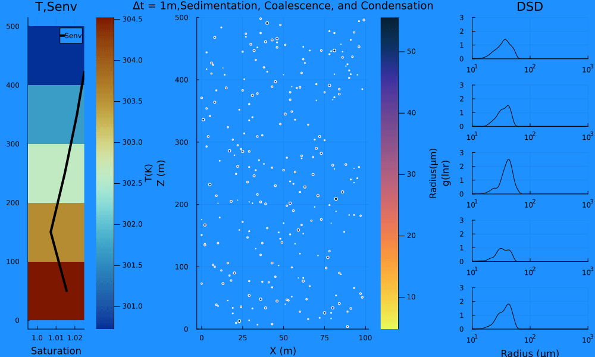

# 
A Julia language implementation of the superdroplet method [(Shima et al., 2009)](https://doi.org/10.1002/qj.441).
[](https://github.com/emmacware/Superdroplet.jl/actions/workflows/CI.yml?query=branch%3Amain)


Current working microphysics include collision-coalescence using the superdroplet method, condensation, feedback on environmental variables (temperature, specific humidity, etc.), and superdroplet lagrangian transport.



Droplets.jl is not currently in the julia directory, so to install and use as a package clone the git repo:

```bash
git clone https://github.com/emmacware/droplets.jl/
```
navigate to the directory

```julia
julia

julia> ]

pkg> dev .

pkg> instantiate
```

<<<<<<< HEAD
to run the Shima et al., 2009 box model collision-coalecence case using the Golovin kernel from terminal, navigate to the Droplets/Examples directory and run
=======
to run the [Shima et al., 2009](https://doi.org/10.1002/qj.441) box model collision-coalecence case (using the Golovin kernel with an initial exponential distribution) from terminal, navigate to the Droplets/Examples directory and run
>>>>>>> main
```bash
julia run_file.jl
```

<<<<<<< HEAD
to edit the run settings on this test case, edit the settings within run_file.jl. 
=======
or on Colab in a jupyter notebook:
[](https://colab.research.google.com/github/emmacware/Droplets.jl/blob/main/Examples/box_collision_coalescence.ipynb)
>>>>>>> main

Help for the Droplets functions and structs can searched with 

```julia
julia> ?
help>
<<<<<<< HEAD
```
=======
```
>>>>>>> main
